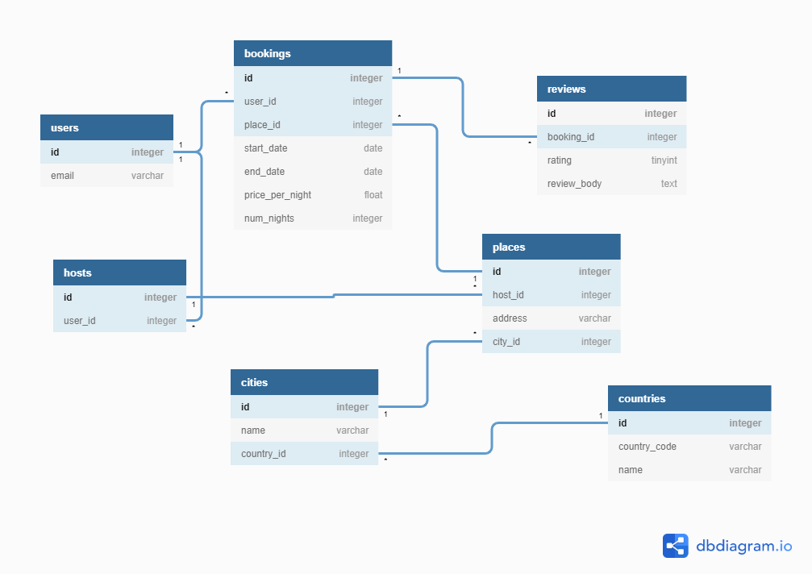

# <center> Tworzenie bazy danych w SQLAlchemy </center>

Skrypt ten opisuje proces tworzenia tabeli w bazie danych za pomocą SQLAlchemy w oparciu o metodologię [ORM](https://en.wikipedia.org/wiki/Object-relational_mapping).

Załóżmy, że chcemy stworzyć tabele:


- Authors

| id 	| name      	| surname       	| born_date  	|
|:--:	|:-----------:	|:---------------:	|:------------:	|
| 1  	| William   	| Shakespeare   	| 26.04.1564 	|
| 2  	| Albert    	| Camus         	| 7.11.1913  	|

- Books

| id 	| id_author 	| original_title 	| publication_date 	| original_language 	|
|:--:	|:---------:	|:--------------:	|:----------------:	|:-----------------:	|
|  1 	|     1     	|     Hamlet     	|       1603       	|      english      	|
|  2 	|     1     	|    King Lear   	|       1606       	|      english      	|
|  3 	|     2     	|    La Peste    	|       1947       	|       french      	|

### Niezbędne biblioteki
Rozpoczęcie tworzenia bazy danych standardowo rozpoczynamy od połączenia się z serwerem bazy danych: 

```python
from sqlalchemy import create_engine
from sqlalchemy.ext.declarative import declarative_base

db_string = "postgres://user:password@ip_adrress:port/db_name"

engine = create_engine(db_string)

Base = declarative_base()

```

Użycie technik ORM, polega na opisie struktury bazydanych bazy danych (tabel) za pomocą klas. Proces ten ma nazwę [Declarative System](https://docs.sqlalchemy.org/en/13/orm/extensions/declarative/index.html). W SQLAlchemy korzystamy z tej funkcjonalności przez API [declarative](https://docs.sqlalchemy.org/en/13/orm/extensions/declarative/api.html).

Linia  
*Base = declarative_base()*  
uruchamia automatycznie proces mapowania istniejących tabel w bazie danych do klasy i daje nam narzędzia do deklarowania nowego schematu tabel.

### Tworzenie struktury tabel

Aby zadeklarować nowy schemat tabeli musimy dodać narzędzia do mapowania typów zmiennych z bazy danych do Pythona:

```python
from sqlalchemy import Column, Integer, String, Date
```

Następnie możemy zadeklarować strukturę tabeli *authors*:

```python
class Author(Base):
    __tablename__ = 'authors'
    id = Column(Integer, primary_key=True)
    name = Column(String(50))
    surname = Column(String(50))
    born_date = Column(Date)

    def __repr__(self):
        return "<authors(id='{0}', name={1}, surname={2}, born_date={3})>".format(
            self.id, self.name, self.surnamey, self.born_date)
```

Do poprawnego działania mechanizmu *declarative_base* musimy ustawić atrybut **\_\_tablename\_\_**. Serwer bazy danych używa **__tablename__** jako nazwy tabeli.
W kolumnie **name** i **surname** używamy *String(50)*, aby wprowadzić ograniczenie do przechowywania długości łańcucha w bazie danych. *primary_key=True* definiuje klucz podstawowy tej tabeli. Nazwa kolumn używana na serwerze bazy danych jest identyczna jak nazwa atrybutów klasy w Pythonie.
Ta procedura jest odpowiednikiem kodu SQL:

```sql
CREATE TABLE public.authors
(
    id integer NOT NULL DEFAULT nextval('authors_id_seq'::regclass),
    name character varying(50),
    surname character varying(50),
    born_date date,
    CONSTRAINT authors_pkey PRIMARY KEY (id)
)

TABLESPACE pg_default;

ALTER TABLE public.authors
    OWNER to postgres;
```

Funkcja *\_\_repr\_\_* jest dekoratorem do formatowania ciągu po wynikach zapytania.


Załóżmy, że chcemy teraz utworzyć nową tabelę *books*, w której łączymy książki z autorem. W tym celu musimy stworzyć relację między tabelą *authors* i *books* według klucza obcego w tabeli *books*.

Na początku

```python
from sqlalchemy import ForeignKey

class Book(Base):
    __tablename__ = 'books'
    id = Column(Integer, primary_key=True)
    id_author = Column(Integer, ForeignKey('authors.id'))
    original_title = Column(String, nullable = False)
    publication_date = Column(Integer, nullable = False)
    original_language = Column(String(), nullable = False)
```

Do stworzenia wszystkich tabel z opisanego schematu możemy użyć skryptu:
```python
Base.metadata.create_all(engine)
```

jeżeli jednak chcemy stworzyć tylko jedną wybraną tablę uzyjemy formuły:

```python
Book.__table__.create(engine)
```

#### Alternatywna metoda deklaracji schematu tabeli
Oczywiście sposób tworzenia tabel przedstawiony w poprzednim rozdziale nie jest jedynym. Możemy opisać tabelę za pomocą obiektu *Table* i utworzyć schemat tej tabeli za pomocą funkcji *create*.

***Przykład:***
```python
from sqlalchemy import Table, MetaData
USER = Table('users', MetaData(bind=engine), Column('id', Integer, primary_key = True), Column('name', String(20)))
USER.create(engine)
```

## Ćwiczenie

Na podstawie schematu bazy danych:


Zaimplementuj skrypt, aby utworzyć tę bazę danych w lokalnej instalacji Postgresql